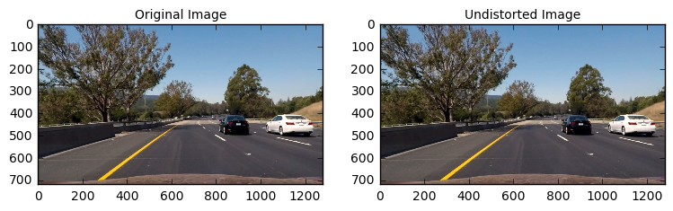
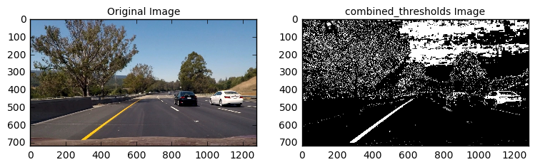
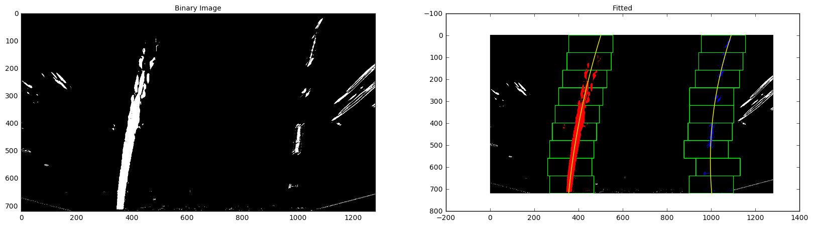

##Writeup Template
###You can use this file as a template for your writeup if you want to submit it as a markdown file, but feel free to use some other method and submit a pdf if you prefer.

---

**Advanced Lane Finding Project**

The goals / steps of this project are the following:

* Compute the camera calibration matrix and distortion coefficients given a set of chessboard images.
* Apply a distortion correction to raw images.
* Use color transforms, gradients, etc., to create a thresholded binary image.
* Apply a perspective transform to rectify binary image ("birds-eye view").
* Detect lane pixels and fit to find the lane boundary.
* Determine the curvature of the lane and vehicle position with respect to center.
* Warp the detected lane boundaries back onto the original image.
* Output visual display of the lane boundaries and numerical estimation of lane curvature and vehicle position.


## [Rubric](https://review.udacity.com/#!/rubrics/571/view) Points
###Here I will consider the rubric points individually and describe how I addressed each point in my implementation.  

---
###Writeup / README

####1. Provide a Writeup / README that includes all the rubric points and how you addressed each one.  You can submit your writeup as markdown or pdf.  [Here](https://github.com/udacity/CarND-Advanced-Lane-Lines/blob/master/writeup_template.md) is a template writeup for this project you can use as a guide and a starting point.  

You're reading it!
###Camera Calibration

####1. Briefly state how you computed the camera matrix and distortion coefficients. Provide an example of a distortion corrected calibration image.

The code for this step is contained in the first code cell of the IPython notebook located in "./Pipeline.ipynb"

I start by preparing "object points", which will be the (x, y, z) coordinates of the chessboard corners in the world. Here I am assuming the chessboard is fixed on the (x, y) plane at z=0, such that the object points are the same for each calibration image.  Thus, `objp` is just a replicated array of coordinates, and `objpoints` will be appended with a copy of it every time I successfully detect all chessboard corners in a test image.  `imgpoints` will be appended with the (x, y) pixel position of each of the corners in the image plane with each successful chessboard detection.  


I then used the output `objpoints` and `imgpoints` to compute the camera calibration and distortion coefficients using the `cv2.calibrateCamera()` function.  I applied this distortion correction to the test image using the `cv2.undistort()` function and obtained this result:


###Pipeline (single images)

####1. Provide an example of a distortion-corrected image.
To demonstrate this step, I will describe how I apply the distortion correction to one of the test images like this one:


####2. Describe how (and identify where in your code) you used color transforms, gradients or other methods to create a thresholded binary image.  Provide an example of a binary image result.

I used a combination of color and gradient thresholds to generate a binary image (thresholding steps in `3. Create a thresholded binary image`).  Here's an example of my output for this step.  (note: this is not actually from one of the test images)



####3. Describe how (and identify where in your code) you performed a perspective transform and provide an example of a transformed image.

The code for my perspective transform includes a function called `warper()`, which appears `4. Apply a perspective transform` in `PipeLine.ipynb`.  The `warper()` function takes as inputs an image (`img`), as well as source (`src`) and destination (`dst`) points.  I chose the hardcode the source and destination points in the following manner:

```
src = np.float32([[(img_size[0] / 2) - 60, img_size[1] / 2 + 100],
                    [((img_size[0] / 6) - 10), img_size[1]],
                    [(img_size[0] * 5 / 6) + 90, img_size[1]],
                    [(img_size[0] / 2 + 60), img_size[1] / 2 + 100]])


dst = np.float32([[(img_size[0] / 4), 0],
                    [(img_size[0] / 4), img_size[1]],
                    [(img_size[0] * 3 / 4), img_size[1]],
                    [(img_size[0] * 3 / 4), 0]])

```
This resulted in the following source and destination points:

| Source        | Destination   |
|:-------------:|:-------------:|
| 585, 460      | 320, 0        |
| 203.3, 720      | 320, 720      |
| 1126.7, 720     | 960, 720      |
| 695, 460      | 960, 0        |

I verified that my perspective transform was working as expected by drawing the `src` and `dst` points onto a test image and its warped counterpart to verify that the lines appear parallel in the warped image.


####4. Describe how (and identify where in your code) you identified lane-line pixels and fit their positions with a polynomial?

I used the sliding window method implementation provided by Udacity.

The sliding window method follows these steps:
1. Generate a histogram against the bottom half of the binary image
2. Use the peaks to determine the location of the lane lines at the bottom of the image 3. Find the rectangle with the most activated pixels in each rectangular column of the image.
4. Add that rectangle to an array.
5. Fit a second order polynomial to the pixel positions derived from the array of rectangles.
6. Repeat steps 3-5 for each new frame using the base search location from the first frame.

Here is the result of the method applied to the binary image: The green boxes represent the rectangles bounding the lane line at each column. The yellow line represents the polynomial function that was fit to each lane line.



####5. Describe how (and identify where in your code) you calculated the radius of curvature of the lane and the position of the vehicle with respect to center.

I did this `6. Determine the curvature of the lane and vehicle position with respect to center` in `PipeLine.ipynb`

####6. Provide an example image of your result plotted back down onto the road such that the lane area is identified clearly.

I implemented this step in `7. Warp the detected lane boundaries back onto the original image` in my code in `PipeLine.ipynb`.  Here is an example of my result on a test image:


---

###Pipeline (video)

####1. Provide a link to your final video output.  Your pipeline should perform reasonably well on the entire project video (wobbly lines are ok but no catastrophic failures that would cause the car to drive off the road!).

Here's a [link to my video result](./project_output.mp4)

---

###Discussion

####1. Briefly discuss any problems / issues you faced in your implementation of this project.  Where will your pipeline likely fail?  What could you do to make it more robust?

I feel that it is very tough to choose the optimal hyper parameters such as color spaces, sobel and thresholds. However, my pipeline still has a few error for video like below:


I think that these error caused by such as shadow, intensity and road color (almost same color as lane lines), so test image 1 and 4 are key for debugging my error. I tried many combination of parameters and check the test image 1 and 4 results whether it could find the line. Finally, I got the optimal parameters for this project, but my future work is that I should find out a good way to get the optimal parameters
